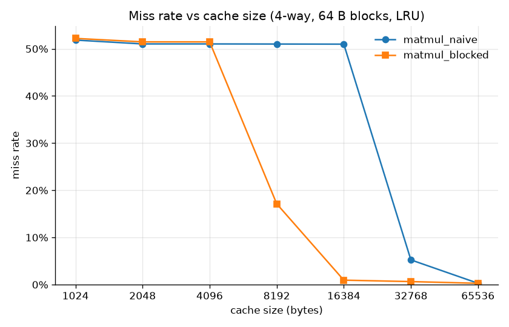
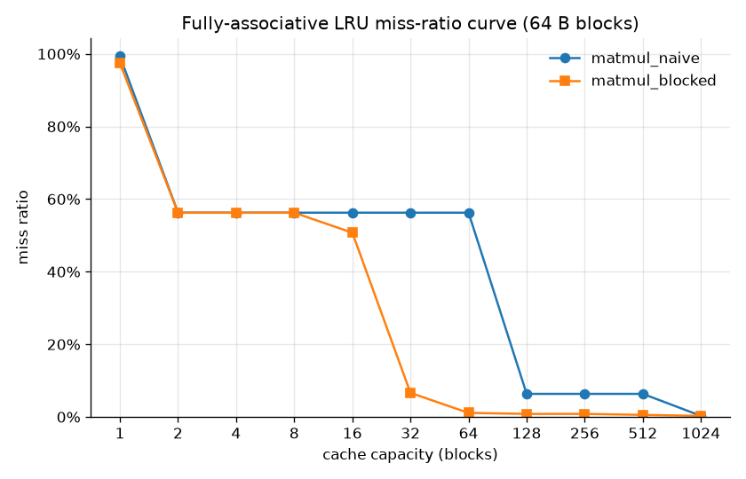
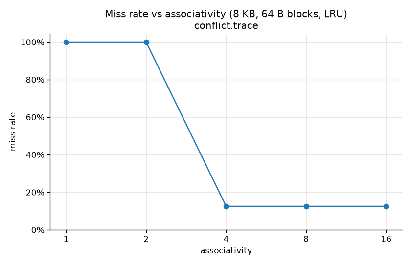
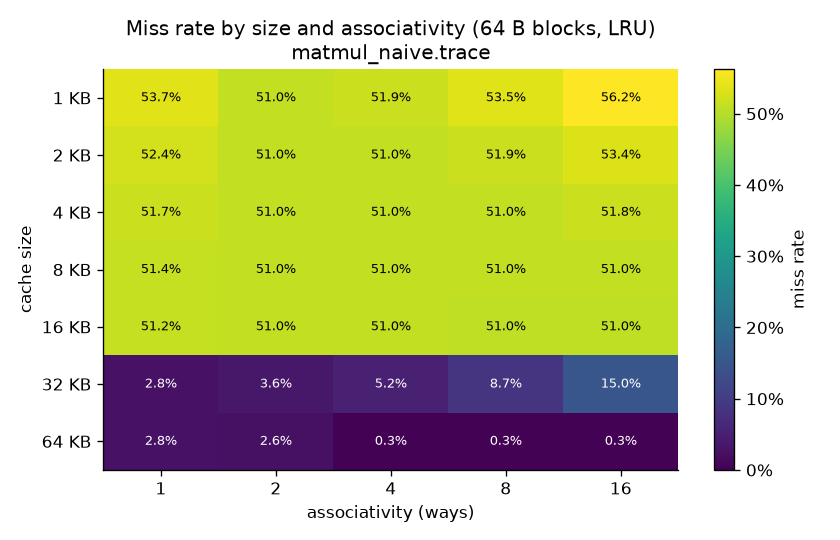
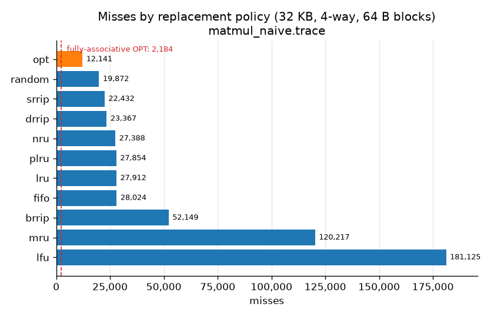
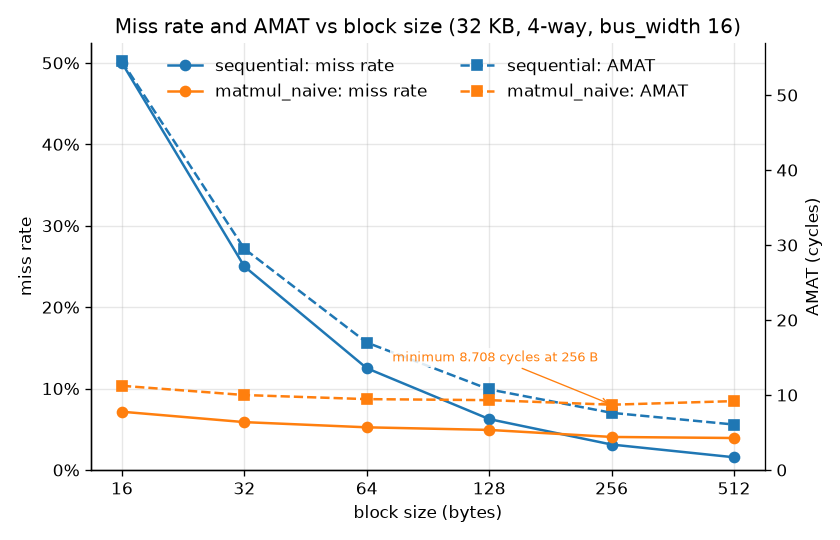

# Results

Measured behaviour of the simulator on its six sample workloads. Every number on this
page was produced by the command printed beside it, in this repository, at the current
revision; nothing is quoted from another source. Counts (accesses, hits, misses,
evictions, DRAM transfers) are exact properties of the trace and the configuration, and
cycles and AMAT are the model's cycles, not measurements of any physical machine.

The workloads themselves are described in [workloads.md](workloads.md), the timing and
replacement model in [model.md](model.md), the configuration keys used below in
[configuration.md](configuration.md), and the subcommands in [cli.md](cli.md). The
checks that the numbers are self-consistent are in [validation.md](validation.md).

Everything starts from the sample traces, which are generated rather than stored:

```bash
cachesim gen-traces --out-dir traces
```

Commands are written for the installed console script. From a source checkout without
installing, `PYTHONPATH=. python -m cachesim <command>` is the same program. The
configurations used by sections that need a geometry not shipped in `configs/` are
written to `/tmp/cachesim-docs/` by the `cat` blocks below.

The default hierarchy referred to throughout is `configs/default.json`: a 32 KB 4-way
L1 with a 4-cycle hit time, a 256 KB 8-way L2 at 12 cycles, a 2 MB 16-way L3 at 40
cycles, 64-byte blocks, LRU, write-back and write-allocate at every level, NINE
inclusion, and a constant 100-cycle main memory.

## Contents

1. [The six workloads on the default hierarchy](#1-the-six-workloads-on-the-default-hierarchy)
2. [Loop order: naive against blocked matrix multiply](#2-loop-order-naive-against-blocked-matrix-multiply)
3. [Associativity, and why more ways can be worse](#3-associativity-and-why-more-ways-can-be-worse)
4. [Replacement policies against Belady's OPT](#4-replacement-policies-against-beladys-opt)
5. [XOR-folded indexing against modulo indexing](#5-xor-folded-indexing-against-modulo-indexing)
6. [Block size, transfer time and AMAT](#6-block-size-transfer-time-and-amat)
7. [Inclusion policies](#7-inclusion-policies)
8. [Hardware prefetchers](#8-hardware-prefetchers)
9. [DRAM row buffer](#9-dram-row-buffer)
10. [Victim cache](#10-victim-cache)
11. [Per-set diagnostics](#11-per-set-diagnostics)
12. [Write policies](#12-write-policies)

## 1. The six workloads on the default hierarchy

```bash
for t in sequential random matmul_naive matmul_blocked conflict pointer_chase; do
    cachesim run "traces/$t.trace" --format json
    cachesim trace-stats "traces/$t.trace"
done
cachesim run traces/matmul_naive.trace --check
```

Per level, with the local miss rate (misses divided by the accesses that reached that
level):

| trace | accesses | L1 hits | L1 misses | L1 miss rate | L2 hits | L2 misses | L2 miss rate | L3 hits | L3 misses | L3 miss rate |
|---|---|---|---|---|---|---|---|---|---|---|
| sequential | 65,536 | 57,344 | 8,192 | 12.50% | 4,096 | 4,096 | 50.00% | 0 | 4,096 | 100.00% |
| random | 60,000 | 107 | 59,893 | 99.82% | 786 | 59,107 | 98.69% | 4,368 | 54,739 | 92.61% |
| matmul_naive | 532,480 | 504,568 | 27,912 | 5.24% | 26,376 | 1,536 | 5.50% | 0 | 1,536 | 100.00% |
| matmul_blocked | 557,056 | 553,484 | 3,572 | 0.64% | 2,036 | 1,536 | 43.00% | 0 | 1,536 | 100.00% |
| conflict | 65,536 | 57,344 | 8,192 | 12.50% | 0 | 8,192 | 100.00% | 0 | 8,192 | 100.00% |
| pointer_chase | 60,000 | 0 | 60,000 | 100.00% | 0 | 60,000 | 100.00% | 43,616 | 16,384 | 27.31% |

Totals, with both forms of AMAT:

| trace | reads | writes | DRAM reads | DRAM writes | cycles | AMAT (analytic) | AMAT (measured) |
|---|---|---|---|---|---|---|---|
| sequential | 58,983 | 6,553 | 4,096 | 0 | 933,888 | 14.250 | 14.250 |
| random | 44,832 | 15,168 | 54,739 | 5,823 | 8,796,896 | 146.615 | 146.615 |
| matmul_naive | 528,384 | 4,096 | 1,536 | 0 | 2,679,904 | 5.033 | 5.033 |
| matmul_blocked | 540,672 | 16,384 | 1,536 | 0 | 2,486,128 | 4.463 | 4.463 |
| conflict | 65,536 | 0 | 8,192 | 0 | 1,507,328 | 23.000 | 23.000 |
| pointer_chase | 60,000 | 0 | 16,384 | 0 | 4,998,400 | 83.307 | 83.307 |

AMAT spans a factor of 33 across these workloads on identical hardware, from 4.463
cycles for the blocked matrix multiply to 146.615 for the random stream. Analytic and
measured AMAT agree exactly, as they must for an allocate-on-miss NINE hierarchy with
no transfer term: every level's access count is the level above's miss count. DRAM
reads equal the trace's distinct-block count — its compulsory-miss floor, printed by
`cachesim trace-stats` — for five of the six workloads: 4,096 for `sequential`, 1,536
for both matrix multiplies, 8,192 for `conflict` and 16,384 for `pointer_chase`. Only
`random`, whose 3.3 MB footprint exceeds the 2 MB L3, drives DRAM reads (54,739) above
its floor of 53,671 distinct blocks. `conflict` misses L1 at
exactly its compulsory rate and never hits below it, because no block in that trace is
referenced twice. Adding `--check` to any of these runs reports `invariants: 62 checks
passed`.

## 2. Loop order: naive against blocked matrix multiply

Both traces multiply the same two 64x64 matrices of doubles and touch the same 1,536
blocks; they differ only in loop order. The size sweep runs one 4-way level of each
capacity directly against DRAM, so nothing below absorbs its misses:

```bash
cachesim sweep --param size traces/matmul_naive.trace --no-plot
cachesim sweep --param size traces/matmul_blocked.trace --no-plot
PYTHONPATH=. python scripts/make_figures.py --out docs/figures
```



| size | naive misses | naive miss rate | naive AMAT | blocked misses | blocked miss rate | blocked AMAT |
|---|---|---|---|---|---|---|
| 1 KB | 276,096 | 51.85% | 55.85 | 290,816 | 52.21% | 56.21 |
| 2 KB | 271,744 | 51.03% | 55.03 | 286,720 | 51.47% | 55.47 |
| 4 KB | 271,744 | 51.03% | 55.03 | 286,720 | 51.47% | 55.47 |
| 8 KB | 271,632 | 51.01% | 55.01 | 95,424 | 17.13% | 21.13 |
| 16 KB | 271,496 | 50.99% | 54.99 | 5,256 | 0.94% | 4.94 |
| 32 KB | 27,912 | 5.24% | 9.24 | 3,572 | 0.64% | 4.64 |
| 64 KB | 1,536 | 0.29% | 4.29 | 1,536 | 0.28% | 4.28 |

The stack-distance profiler gives the same comparison free of any set mapping: exact
fully-associative LRU miss ratios at every capacity, from one pass per trace.

```bash
cachesim mrc traces/matmul_naive.trace
cachesim mrc traces/matmul_blocked.trace
```



| capacity (blocks) | size | naive misses | naive miss ratio | blocked misses | blocked miss ratio |
|---|---|---|---|---|---|
| 1 | 64 B | 528,896 | 99.33% | 542,720 | 97.43% |
| 2 | 128 B | 299,520 | 56.25% | 313,344 | 56.25% |
| 4 | 256 B | 299,520 | 56.25% | 313,344 | 56.25% |
| 8 | 512 B | 299,520 | 56.25% | 313,344 | 56.25% |
| 16 | 1 KB | 299,520 | 56.25% | 282,624 | 50.74% |
| 32 | 2 KB | 299,520 | 56.25% | 36,864 | 6.62% |
| 64 | 4 KB | 299,520 | 56.25% | 6,144 | 1.10% |
| 128 | 8 KB | 33,792 | 6.35% | 4,608 | 0.83% |
| 256 | 16 KB | 33,792 | 6.35% | 4,608 | 0.83% |
| 512 | 32 KB | 33,792 | 6.35% | 3,072 | 0.55% |
| 1,024 | 64 KB | 1,536 | 0.29% | 1,536 | 0.28% |

`cachesim mrc` also reports the working set, the smallest capacity whose miss ratio is
within one percentage point of the compulsory floor: **537 blocks (33.6 KB)** for
`matmul_naive` and **39 blocks (2.4 KB)** for `matmul_blocked`, a factor of 13.8 for
the same 1,536-block footprint and the same 1,536 DRAM reads. Tiling changes reuse
distance, not traffic. The consequence in the sweep is a cliff at a different capacity:
the blocked version is already at 0.94% in 16 KB, while the naive version stays above
50% until 32 KB, and only reaches its floor at 64 KB. The miss-ratio curve shows the same
thing without any set mapping in the way: the naive multiply needs 128 blocks to fall to
6.35% and 1,024 to reach 0.29%, while the blocked one is at 1.10% with 64. Under the
default hierarchy
(section 1) the difference is 27,912 L1 misses against 3,572 and 5.033 cycles of AMAT
against 4.463, a smaller gap than the L1 miss rates suggest, because the 256 KB L2
catches almost everything the naive version drops.

## 3. Associativity, and why more ways can be worse

`conflict.trace` reads four sequential streams in lockstep with their bases 1 MB apart.
1 MB is 16,384 blocks, so element X of every stream lands in the same set for any
geometry whose set count divides 16,384, and whether an access hits is decided by ways
alone:

```bash
cachesim sweep --param associativity traces/conflict.trace --no-plot
```



| ways | sets | misses | miss rate | AMAT | compulsory | capacity | conflict |
|---|---|---|---|---|---|---|---|
| 1 | 128 | 65,536 | 100.00% | 104.00 | 8,192 | 0 | 57,344 |
| 2 | 64 | 65,536 | 100.00% | 104.00 | 8,192 | 0 | 57,344 |
| 4 | 32 | 8,192 | 12.50% | 16.50 | 8,192 | 0 | 0 |
| 8 | 16 | 8,192 | 12.50% | 16.50 | 8,192 | 0 | 0 |
| 16 | 8 | 8,192 | 12.50% | 16.50 | 8,192 | 0 | 0 |

The capacity and conflict columns are the aggregate decomposition of Hill and Smith:
capacity is fully-associative LRU misses minus compulsory misses, conflict is misses
minus fully-associative LRU misses. Below four ways every miss above the compulsory
floor is a conflict miss; at four ways the four hot blocks fit in one set and the cache
reaches the floor, and further ways buy nothing. An 8 KB cache holds 128 blocks
throughout, so capacity is never the constraint.

The same sweep on a strided workload does not flatten. The grid replays
`matmul_naive.trace` through every feasible combination of the two axes:

```bash
cachesim sweep --grid traces/matmul_naive.trace --no-plot
```



| size | 1-way | 2-way | 4-way | 8-way | 16-way |
|---|---|---|---|---|---|
| 1 KB | 53.73% | 51.03% | 51.85% | 53.49% | 56.25% |
| 2 KB | 52.38% | 51.03% | 51.03% | 51.85% | 53.39% |
| 4 KB | 51.71% | 51.03% | 51.03% | 51.03% | 51.80% |
| 8 KB | 51.37% | 51.03% | 51.01% | 51.01% | 51.01% |
| 16 KB | 51.20% | 51.02% | 50.99% | 50.96% | 50.96% |
| 32 KB | 2.85% | 3.59% | 5.24% | 8.66% | 15.03% |
| 64 KB | 2.85% | 2.60% | 0.29% | 0.29% | 0.29% |

The command prints a note for every row that goes the wrong way, including:

```text
note: not monotonic at 32 KB -- 4 of 4 steps increased misses; best 1-way (15,152), worst 16-way (80,016); at a fixed size, more ways means fewer sets
```

Misses at 32 KB rise from 15,152 to 80,016, a factor of 5.3, as associativity goes from
1 to 16. At a fixed capacity, more ways means fewer sets: 512 sets at 1-way down to 32
sets at 16-way. The inner loop of the naive multiply walks a column of B with a 512-byte
stride, which is 8 blocks, so consecutive references of a column land 8 sets apart. With
512 sets a column's 64 blocks reach 64 distinct sets; with 32 sets they reach only 4,
and the rows of A and C that are live at the same time have to share them. Fewer sets
concentrate a power-of-two stride's aliasing, and that costs more than the extra ways
recover. Aggregate conflict misses can also be negative here (-5,880 at 32 KB 4-way):
the set mapping beats fully-associative LRU on this trace, which is the anti-conflict
case the Hill and Smith decomposition allows for, not an error.

## 4. Replacement policies against Belady's OPT

Every registered policy through the same geometry, against the offline optimum:

```bash
cachesim policies traces/matmul_naive.trace
```



| policy | misses | miss rate | AMAT | x OPT |
|---|---|---|---|---|
| opt | 12,141 | 2.28% | 6.28 | 1.00 |
| random | 19,872 | 3.73% | 7.73 | 1.64 |
| srrip | 22,432 | 4.21% | 8.21 | 1.85 |
| drrip | 23,367 | 4.39% | 8.39 | 1.92 |
| nru | 27,388 | 5.14% | 9.14 | 2.26 |
| plru | 27,854 | 5.23% | 9.23 | 2.29 |
| lru | 27,912 | 5.24% | 9.24 | 2.30 |
| fifo | 28,024 | 5.26% | 9.26 | 2.31 |
| brrip | 52,149 | 9.79% | 13.79 | 4.30 |
| mru | 120,217 | 22.58% | 26.58 | 9.90 |
| lfu | 181,125 | 34.02% | 38.02 | 14.92 |

The `opt` row is Belady's rule applied inside each set, which is the best any policy can
do with this set mapping; the command also prints the fully-associative bound, **2,184
misses (0.41%)**, the best any cache of this capacity could do at all. The gap between
the two bounds is 5.6x, and no replacement policy can close it: only associativity or a
different index function can (sections 3 and 5). Among implementable policies, `random`
beats LRU by 1.4x here. The references arriving at one set are close to a cycle slightly
longer than the four ways, which is the pattern where recency is actively misleading:
LRU evicts exactly the block the next column walk asks for next, while random keeps some
of them. The scan-resistant re-reference predictors `srrip` and `drrip` sit between the
two. `brrip`, `mru` and `lfu` bound behaviour from the wrong side rather than proposing
anything: `lfu` never ages its counters, so blocks that accumulated references in an
early column stay resident for the rest of the run.

## 5. XOR-folded indexing against modulo indexing

A hashed index folds the high-order bits of the block number into the set index, so a
power-of-two stride no longer aliases. Only the `index` key changes:

```bash
mkdir -p /tmp/cachesim-docs
cat > /tmp/cachesim-docs/xor-l1.json <<'JSON'
{
  "memory_access_time": 100,
  "levels": [
    {"name": "L1", "size": 32768, "block_size": 64,
     "associativity": 4, "policy": "lru", "hit_time": 4, "index": "xor"},
    {"name": "L2", "size": 262144, "block_size": 64,
     "associativity": 8, "policy": "lru", "hit_time": 12},
    {"name": "L3", "size": 2097152, "block_size": 64,
     "associativity": 16, "policy": "lru", "hit_time": 40}
  ]
}
JSON
cat > /tmp/cachesim-docs/dm8k-modulo.json <<'JSON'
{
  "memory_access_time": 100,
  "levels": [
    {"name": "L1", "size": 8192, "block_size": 64,
     "associativity": 1, "policy": "lru", "hit_time": 4, "index": "modulo"}
  ]
}
JSON
cat > /tmp/cachesim-docs/dm8k-xor.json <<'JSON'
{
  "memory_access_time": 100,
  "levels": [
    {"name": "L1", "size": 8192, "block_size": 64,
     "associativity": 1, "policy": "lru", "hit_time": 4, "index": "xor"}
  ]
}
JSON

cachesim compare traces/matmul_naive.trace --config default --config /tmp/cachesim-docs/xor-l1.json
cachesim compare traces/conflict.trace --config default --config /tmp/cachesim-docs/xor-l1.json
cachesim compare traces/matmul_naive.trace \
    --config /tmp/cachesim-docs/dm8k-modulo.json --config /tmp/cachesim-docs/dm8k-xor.json
cachesim compare traces/conflict.trace \
    --config /tmp/cachesim-docs/dm8k-modulo.json --config /tmp/cachesim-docs/dm8k-xor.json
```

Default hierarchy, index function changed at L1 only:

| trace | index | L1 misses | L1 miss rate | DRAM reads | AMAT | cycles |
|---|---|---|---|---|---|---|
| matmul_naive | modulo | 27,912 | 5.24% | 1,536 | 5.033 | 2,679,904 |
| matmul_naive | xor | 5,470 | 1.03% | 1,536 | 4.527 | 2,410,600 |
| conflict | modulo | 8,192 | 12.50% | 8,192 | 23.000 | 1,507,328 |
| conflict | xor | 8,192 | 12.50% | 8,192 | 23.000 | 1,507,328 |

One 8 KB direct-mapped level in front of DRAM, where nothing below hides the effect:

| trace | index | misses | miss rate | DRAM reads | AMAT | cycles |
|---|---|---|---|---|---|---|
| matmul_naive | modulo | 273,536 | 51.37% | 273,536 | 55.370 | 29,483,520 |
| matmul_naive | xor | 72,735 | 13.66% | 72,735 | 17.660 | 9,403,420 |
| conflict | modulo | 65,536 | 100.00% | 65,536 | 104.000 | 6,815,744 |
| conflict | xor | 8,192 | 12.50% | 8,192 | 16.500 | 1,081,344 |

XOR-folding removes 80% of L1 misses on `matmul_naive` at the default geometry and cuts
its AMAT by 10%, without changing DRAM traffic: the compulsory floor of 1,536 blocks is
a property of the trace, and hashing only decides which blocks collide on the way there.
On the direct-mapped level it takes `conflict.trace` from missing every access to the
compulsory floor — the same result four ways of associativity buy in section 3, for no
extra tag comparisons. It buys nothing on `conflict.trace` at the default geometry,
where the 4-way L1 is already at the floor. The cost is not visible in these tables:
address locality no longer implies set locality, which is what makes per-set reasoning
(section 11) harder under a hashed index.

## 6. Block size, transfer time and AMAT

A wider block lowers the miss rate but takes longer to move. With `bus_width` set to 16
bytes per cycle, a fill costs `ceil(block_size / 16)` cycles on top of the DRAM latency:

```bash
PYTHONPATH=. python scripts/make_figures.py --out docs/figures
```



One 32 KB 4-way level, LRU, hit time 4, DRAM 100, `bus_width` 16:

| block size | transfer cycles | sequential miss rate | sequential AMAT | matmul_naive miss rate | matmul_naive AMAT |
|---|---|---|---|---|---|
| 16 B | 1 | 50.0000% | 54.500 | 7.1575% | 11.229 |
| 32 B | 2 | 25.0000% | 29.500 | 5.8804% | 9.998 |
| 64 B | 4 | 12.5000% | 17.000 | 5.2419% | 9.452 |
| 128 B | 8 | 6.2500% | 10.750 | 4.9226% | 9.316 |
| 256 B | 16 | 3.1250% | 7.625 | 4.0587% | 8.708 |
| 512 B | 32 | 1.5625% | 6.062 | 3.9288% | 9.186 |

Only `matmul_naive` shows the U. `sequential` scans a buffer by 8-byte words and uses
every byte it fetches, so it misses once per block per pass and its closed form is
exact: miss rate `8 / B`, and

```text
AMAT = 4 + (8 / B) * (100 + B / 16) = 4.5 + 800 / B
```

for every block size that is a whole multiple of the 16-byte bus. That expression
decreases monotonically for any bus width, so the trace has no interior minimum to find:
54.500 cycles at 16 B down to 6.062 at 512 B, matching the closed form at every point.
The trade-off needs imperfect spatial locality: the naive multiply strides down
B's columns, so part of every wide block is never used before it is evicted. Its AMAT
bottoms out at **8.708 cycles at 256 B** and rises to 9.186 at 512 B while its miss rate
is still falling, 4.0587% to 3.9288% — past that width the extra transfer time costs
more than the misses it saves.

## 7. Inclusion policies

`inclusion` is declared on the lower level of a pair and names the relation it maintains
with the level above it. The shipped configs apply it to the default 8x size ratios:

```bash
for t in sequential random matmul_naive matmul_blocked conflict pointer_chase; do
    cachesim run "traces/$t.trace" --format json
    cachesim run "traces/$t.trace" --config configs/inclusive.json --format json
    cachesim run "traces/$t.trace" --config configs/exclusive.json --format json
done
```

| trace | L1 back-invalidations (inclusive) | DRAM reads: nine / inclusive / exclusive | DRAM writes: nine / inclusive / exclusive | AMAT: nine / inclusive / exclusive |
|---|---|---|---|---|
| sequential | 0 | 4,096 / 4,096 / 4,096 | 0 / 0 / 0 | 14.250 / 14.250 / 14.250 |
| random | 0 | 54,739 / 54,739 / 54,740 | 5,823 / 5,823 / 5,824 | 146.615 / 146.615 / 146.531 |
| matmul_naive | 0 | 1,536 / 1,536 / 1,536 | 0 / 0 / 0 | 5.033 / 5.033 / 5.033 |
| matmul_blocked | 0 | 1,536 / 1,536 / 1,536 | 0 / 0 / 0 | 4.463 / 4.463 / 4.463 |
| conflict | 0 | 8,192 / 8,192 / 8,192 | 0 / 0 / 0 | 23.000 / 23.000 / 23.000 |
| pointer_chase | 0 | 16,384 / 16,384 / 16,384 | 0 / 0 / 0 | 83.307 / 83.307 / 83.307 |

Shrinking the L2 to twice the L1 makes the same policy expensive. This pair is a 32 KB
4-way L1 over a 64 KB 4-way L2:

```bash
for incl in nine inclusive exclusive; do
cat > /tmp/cachesim-docs/l2-64k-$incl.json <<JSON
{
  "memory_access_time": 100,
  "levels": [
    {"name": "L1", "size": 32768, "block_size": 64,
     "associativity": 4, "policy": "lru", "hit_time": 4},
    {"name": "L2", "size": 65536, "block_size": 64,
     "associativity": 4, "policy": "lru", "hit_time": 12,
     "inclusion": "$incl"}
  ]
}
JSON
done
cachesim compare traces/random.trace \
    --config /tmp/cachesim-docs/l2-64k-nine.json \
    --config /tmp/cachesim-docs/l2-64k-inclusive.json \
    --config /tmp/cachesim-docs/l2-64k-exclusive.json
for t in sequential random matmul_naive matmul_blocked conflict pointer_chase; do
    for incl in nine inclusive exclusive; do
        cachesim run "traces/$t.trace" --config "/tmp/cachesim-docs/l2-64k-$incl.json" --format json
    done
done
```

| trace | inclusion | L1 back-invalidations | L2 misses | DRAM reads | DRAM writes | AMAT |
|---|---|---|---|---|---|---|
| sequential | nine | 0 | 8,192 | 8,192 | 5,734 | 18.000 |
| sequential | inclusive | 0 | 8,192 | 8,192 | 5,734 | 18.000 |
| sequential | exclusive | 0 | 8,192 | 8,192 | 5,324 | 18.000 |
| random | nine | 0 | 59,769 | 59,769 | 14,892 | 115.594 |
| random | inclusive | 3,766 | 59,775 | 59,775 | 14,913 | 115.604 |
| random | exclusive | 0 | 59,644 | 59,644 | 14,776 | 115.385 |
| matmul_naive | nine | 0 | 1,536 | 1,536 | 256 | 4.917 |
| matmul_naive | inclusive | 0 | 1,536 | 1,536 | 256 | 4.917 |
| matmul_naive | exclusive | 0 | 1,536 | 1,536 | 112 | 4.917 |
| matmul_blocked | nine | 0 | 1,536 | 1,536 | 256 | 4.353 |
| matmul_blocked | inclusive | 0 | 1,536 | 1,536 | 256 | 4.353 |
| matmul_blocked | exclusive | 0 | 1,536 | 1,536 | 112 | 4.353 |
| conflict | nine | 0 | 8,192 | 8,192 | 0 | 18.000 |
| conflict | inclusive | 0 | 8,192 | 8,192 | 0 | 18.000 |
| conflict | exclusive | 0 | 8,192 | 8,192 | 0 | 18.000 |
| pointer_chase | nine | 0 | 60,000 | 60,000 | 0 | 116.000 |
| pointer_chase | inclusive | 3,229 | 60,000 | 60,000 | 0 | 116.000 |
| pointer_chase | exclusive | 0 | 60,000 | 60,000 | 0 | 116.000 |

Back-invalidations are counted at the level that loses the block, so an inclusive L2
shows them at L1. The size ratio decides whether inclusion costs anything: at the
default 8x ratios it is free on all six workloads, with zero back-invalidations and
counters identical to NINE, while at 2x the inclusive L2 evicts 3,766 blocks out of L1
on `random` and 3,229 on `pointer_chase`. On `random` that shows up as six extra DRAM
reads and 0.010 cycles of AMAT; on `pointer_chase` it costs nothing measurable, because
neither level ever hits on that trace anyway. Exclusive goes the other way: the pair
holds L1 plus L2 rather than the larger of the two, which takes `random` to 59,644 DRAM
reads and 115.385 cycles, the best of the three. Its other effect is on write traffic:
because every line the L1 evicts moves down clean or dirty, `sequential` writes back
5,324 blocks instead of 5,734 and both matrix multiplies 112 instead of 256.

## 8. Hardware prefetchers

`configs/prefetch_stride.json` puts a tagged next-line prefetcher on L1 and a per-region
stride prefetcher on L2, leaving everything else at the defaults:

```bash
for t in sequential random matmul_naive matmul_blocked conflict pointer_chase; do
    cachesim run "traces/$t.trace" --format json
    cachesim run "traces/$t.trace" --config configs/prefetch_stride.json --format json
done
```

| trace | L1 misses (default) | L1 misses (prefetch) | L1 prefetches issued | accuracy | coverage | AMAT (default) | AMAT (prefetch) | DRAM demand reads | DRAM prefetch reads | DRAM writes |
|---|---|---|---|---|---|---|---|---|---|---|
| sequential | 8,192 | 2 | 8,192 | 99.98% | 99.98% | 14.250 | 4.003 | 4,096 -> 1 | 4,096 | 0 -> 0 |
| random | 59,893 | 59,883 | 59,874 | 0.10% | 0.10% | 146.615 | 144.666 | 54,739 -> 53,588 | 53,449 | 5,823 -> 10,289 |
| matmul_naive | 27,912 | 25,182 | 27,920 | 23.66% | 20.78% | 5.033 | 4.572 | 1,536 -> 19 | 1,520 | 0 -> 0 |
| matmul_blocked | 3,572 | 1,541 | 3,452 | 64.51% | 59.10% | 4.463 | 4.068 | 1,536 -> 139 | 1,408 | 0 -> 0 |
| conflict | 8,192 | 4 | 8,192 | 99.95% | 99.95% | 23.000 | 4.009 | 8,192 -> 4 | 8,192 | 0 -> 0 |
| pointer_chase | 60,000 | 59,053 | 59,132 | 1.60% | 1.58% | 83.307 | 63.716 | 16,384 -> 8,179 | 8,207 | 0 -> 0 |

Accuracy is the share of issued prefetches a demand reference later hit; coverage is the
share of the demand misses the prefetcher removed. Next-line prefetching almost erases
the misses of the two workloads that walk memory in order (`sequential` 8,192 to 2,
`conflict` 8,192 to 4, since four interleaved streams are still four sequential walks),
and the L2 stride prefetcher is what helps `pointer_chase`: L1 gains almost nothing
(1.6% accurate) while DRAM reads halve, 16,384 to 8,179, which is worth 19.6 cycles of
AMAT. The two figures to read together are accuracy and DRAM traffic. On `random`, 0.10%
accuracy
means the prefetcher fetches 53,449 blocks from DRAM that nobody wants, evicts useful
lines in their place, and pushes DRAM writes from 5,823 to 10,289 — pollution paid for
in write bandwidth for 1.9 cycles of AMAT. Prefetches are charged no time in this model
(they are assumed to overlap with useful work), so the AMAT column is optimistic by
construction and the pollution column is the part to trust.

## 9. DRAM row buffer

`configs/dram_row_buffer.json` replaces the constant 100-cycle memory with an open-page
DRAM: 8 KB rows, 8 banks, 40 cycles for a row-buffer hit and 100 for a row miss. It also
sets `bus_width` 16 on L3, so an L3 fill costs 4 extra cycles.

```bash
for t in sequential random matmul_naive matmul_blocked conflict pointer_chase; do
    cachesim run "traces/$t.trace" --config configs/dram_row_buffer.json --format json
done
```

| trace | row hits | row misses | row-buffer hit rate | average DRAM latency | AMAT (constant 100) | AMAT (row buffer) |
|---|---|---|---|---|---|---|
| sequential | 4,064 | 32 | 99.22% | 40.47 | 14.250 | 10.779 |
| random | 232 | 60,330 | 0.38% | 99.75 | 146.615 | 150.032 |
| matmul_naive | 1,383 | 153 | 90.04% | 45.98 | 5.033 | 4.889 |
| matmul_blocked | 1,376 | 160 | 89.58% | 46.25 | 4.463 | 4.326 |
| conflict | 0 | 8,192 | 0.00% | 100.00 | 23.000 | 23.500 |
| pointer_chase | 1,056 | 15,328 | 6.45% | 96.13 | 83.307 | 83.343 |

The same 100-cycle worst case costs between 40.47 and 100.00 cycles on average depending
only on the order of the misses: a sequential miss stream walks one row at a time and
finds it open 99.22% of the time, while a random one activates a new row nearly every
access. The AMAT column moves for two reasons, and they separate exactly: the change
equals the latency term, `(average_latency - 100) * dram_reads / accesses`, plus the
transfer term, `4 * L3_fills / accesses`. For `random` that is -0.232 and +3.649, which
is why AMAT gets worse (+3.417) even though the memory model is more detailed. For
`conflict` the latency term is exactly zero and the whole +0.500 is transfer time.
`conflict` is the worked example of address-to-bank mapping: its four streams are 1 MB
apart, a row is 8 KB, so corresponding elements are 128 rows apart, and a block's bank
is `row % 8`. Since 128 is a multiple of 8, all four streams land in the same bank
and evict each other's open row on every access — 0.00% row hits, with seven banks
idle.

## 10. Victim cache

A victim cache is a small fully-associative buffer of the lines a level's array has
replaced. On `conflict.trace` the number of entries needed is exactly predictable: four
streams share one set, a direct-mapped level holds one of them, so three victims must be
buffered.

```bash
cat > /tmp/cachesim-docs/victim-none.json <<'JSON'
{
  "memory_access_time": 100,
  "levels": [
    {"name": "L1", "size": 32768, "block_size": 64,
     "associativity": 1, "policy": "lru", "hit_time": 4}
  ]
}
JSON
for n in 2 3 4; do
cat > /tmp/cachesim-docs/victim-$n.json <<JSON
{
  "memory_access_time": 100,
  "levels": [
    {"name": "L1", "size": 32768, "block_size": 64,
     "associativity": 1, "policy": "lru", "hit_time": 4,
     "victim_cache": {"entries": $n}}
  ]
}
JSON
done
for cfg in none 2 3 4; do
    cachesim run traces/conflict.trace --config "/tmp/cachesim-docs/victim-$cfg.json" --format json
done
for t in conflict matmul_naive matmul_blocked random; do
    cachesim run "traces/$t.trace" --config configs/victim_cache.json --format json
done
```

One 32 KB direct-mapped level in front of DRAM:

| victim-cache entries | misses | miss rate | victim hits | DRAM reads | AMAT |
|---|---|---|---|---|---|
| 0 (key omitted) | 65,536 | 100.00% | 0 | 65,536 | 104.000 |
| 2 | 65,536 | 100.00% | 0 | 65,536 | 104.000 |
| 3 | 8,192 | 12.50% | 57,344 | 8,192 | 16.500 |
| 4 | 8,192 | 12.50% | 57,344 | 8,192 | 16.500 |

The threshold is sharp. Two entries are one short of the three displaced streams, so
every reference still finds its block gone and the workload misses every access; the
third entry takes the level straight to 8,192 misses, the compulsory floor a
fully-associative cache of any size would also hit, and the fourth adds nothing. Three
lines of storage are worth 87.5 cycles of AMAT here. `configs/victim_cache.json`
applies the same idea to a full hierarchy — a direct-mapped L1 with a 3-cycle hit time
and 4 entries, over the default L2 and L3 — where it takes 57,344 victim hits on
`conflict`, 12,521 on `matmul_naive`, 15,939 on `matmul_blocked` and exactly 1 on
`random`: the feature helps exactly the workloads whose misses are conflict misses. Note
that `victim_cache` entries must be at least 1, so the zero row is the key omitted.

## 11. Per-set diagnostics

`cachesim sets` reports two things about how a workload uses the sets of one level: the
cumulative miss histogram, and windowed set pressure, which counts `(window, set)` pairs
where the distinct blocks mapping to a set in a window of 512 accesses exceed the ways.

```bash
cachesim sets traces/matmul_naive.trace
cachesim sets traces/conflict.trace
cachesim sets traces/conflict.trace --size 4k --assoc 1
```

| trace and geometry | misses | per-set min / mean / max | max/mean | hottest 5% share (uniform) | oversubscribed pairs | windows affected | distinct per touched set |
|---|---|---|---|---|---|---|---|
| matmul_naive, 32 KB 4-way (128 sets) | 27,912 | 212 / 218.1 / 220 | 1.01 | 5.52% (5.47%) | 1,480 of 31,384 = 4.72% | 1,040 of 1,040 = 100.00% | mean 3.23, max 6 |
| conflict, 32 KB 4-way (128 sets) | 8,192 | 64 / 64.0 / 64 | 1.00 | 5.47% (5.47%) | 0 of 2,048 = 0.00% | 0 of 128 = 0.00% | mean 4.00, max 4 |
| conflict, 4 KB 1-way (64 sets) | 65,536 | 1,024 / 1,024.0 / 1,024 | 1.00 | 6.25% (6.25%) | 2,048 of 2,048 = 100.00% | 128 of 128 = 100.00% | mean 4.00, max 4 |

The cumulative histogram is nearly uniform in all three rows and separates none of them,
although the three miss rates are 5.24%, 12.50% and 100.00%. That is the point of
measuring both: over a whole trace the hot blocks move, so summing misses per set
averages the evidence away. The windowed measure does separate them. `conflict` at four
ways has exactly 4.00 distinct blocks per touched set and no oversubscription, which is
why it sits at its compulsory floor; the same trace at one way oversubscribes every
touched pair in every window and misses every access. `matmul_naive` oversubscribes only
4.72% of its touched pairs, but does so in every one of its 1,040 windows: a few sets are
over capacity at any instant, and which few changes as the loops advance, which is
exactly why the cumulative histogram cannot see it. The windowed figure needs no
simulation, being a property of the address stream and the set mapping alone, so it is
the cheaper of the two measurements as well as the more informative.

## 12. Write policies

`configs/write_through_l1.json` makes L1 write-through and no-write-allocate, leaving L2
and L3 write-back and write-allocate. `random.trace` is the workload with real store
traffic: 15,168 of its 60,000 accesses are stores.

```bash
cachesim run traces/random.trace --format json
cachesim run traces/random.trace --config configs/write_through_l1.json --format json
```

| counter | default (write-back, write-allocate) | write-through, no-write-allocate L1 |
|---|---|---|
| L1 accesses | 60,000 | 60,000 |
| L1 misses | 59,893 (99.82%) | 59,887 (99.81%) |
| L1 fills | 59,893 | 44,746 |
| L1 write-backs | 15,027 | 0 |
| L1 write-throughs | 0 | 27 |
| L1 write bypasses | 0 | 15,141 |
| L2 accesses | 59,893 | 59,887 |
| L2 modified blocks received | 15,027 | 27 |
| DRAM reads | 54,739 | 54,739 |
| DRAM writes | 5,823 | 5,823 |
| AMAT | 146.614933 | 146.613733 |
| cycles | 8,796,896 | 8,796,824 |

The two keys are orthogonal and both are visible here. No-write-allocate means a store
that misses L1 is not fetched into it: 15,141 of the 15,168 stores bypass L1 entirely and
are handled by L2, and L1 fills drop to the 44,746 read misses. Write-through means the
27 stores that did hit L1 are applied there and duplicated down, arriving at L2 as
modified data; no line in L1 is ever dirty, so its 15,027 write-backs become zero. What
does not change is DRAM: 5,823 writes either way, because the traffic is only moved from
the L1/L2 boundary to the L2 array, and what reaches memory is decided by L3's dirty
evictions. The AMAT difference of 0.0012 cycles is not the write policy: the run is 72
cycles shorter, which is exactly the six avoided L1 misses at L2's 12-cycle probe.
Write-through duplicates and write-backs are both untimed in this model, on the
assumption that a write buffer absorbs them.

## References

The techniques measured above, in the order they appear.

- M. D. Hill and A. J. Smith, "Evaluating Associativity in CPU Caches", IEEE
  Transactions on Computers 38(12), 1989. The compulsory/capacity/conflict decomposition
  used in sections 1 and 3.
- R. L. Mattson, J. Gecsei, D. R. Slutz and I. L. Traiger, "Evaluation techniques for
  storage hierarchies", IBM Systems Journal 9(2), 1970. Stack distances and the one-pass
  miss curves of section 2.
- L. A. Belady, "A study of replacement algorithms for a virtual-storage computer",
  IBM Systems Journal 5(2), 1966. The OPT bound of section 4.
- A. Jaleel, K. B. Theobald, S. C. Steely and J. Emer, "High Performance Cache
  Replacement Using Re-Reference Interval Prediction (RRIP)", ISCA 2010, and M. K.
  Qureshi, A. Jaleel, Y. N. Patt, S. C. Steely and J. Emer, "Adaptive Insertion Policies
  for High Performance Caching", ISCA 2007. The SRRIP, BRRIP and DRRIP rows of section 4.
- A. Gonzalez, M. Valero, N. Topham and J. M. Parcerisa, "Eliminating cache conflict
  misses through XOR-based placement functions", ICS 1997. The hashed index of section 5.
- J. L. Hennessy and D. A. Patterson, "Computer Architecture: A Quantitative Approach",
  6th ed., Morgan Kaufmann, 2017, Appendix B. AMAT, block size, and the write policies of
  sections 6 and 12.
- J.-L. Baer and W.-H. Wang, "On the Inclusion Properties for Multi-Level Cache
  Hierarchies", ISCA 1988. The inclusion policies of section 7.
- T.-F. Chen and J.-L. Baer, "Effective Hardware-Based Data Prefetching for
  High-Performance Processors", IEEE Transactions on Computers 44(5), 1995. The stride
  prefetcher of section 8.
- S. Rixner, W. J. Dally, U. J. Kapasi, P. Mattson and J. D. Owens, "Memory Access
  Scheduling", ISCA 2000. The open-page DRAM model of section 9.
- N. P. Jouppi, "Improving Direct-Mapped Cache Performance by the Addition of a Small
  Fully-Associative Cache and Prefetch Buffers", ISCA 1990. The victim cache of
  section 10.

---

Back to the [README](../README.md).
